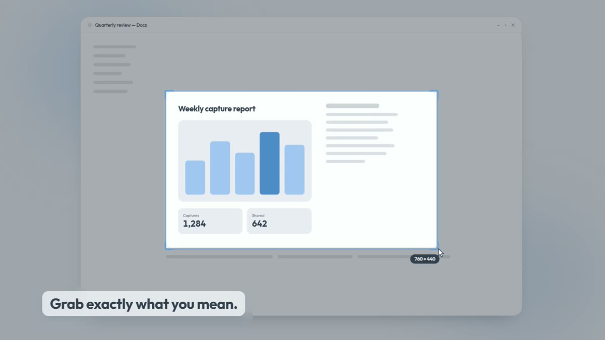
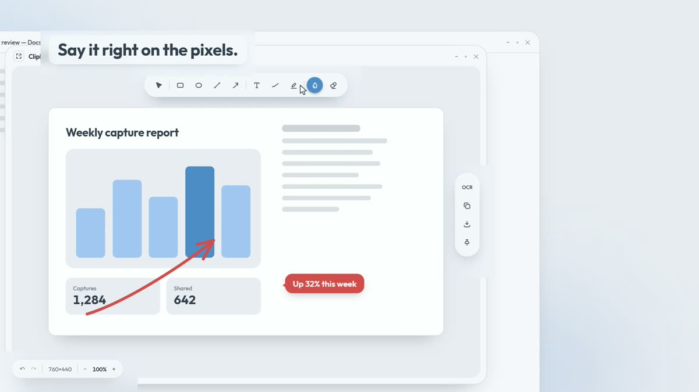
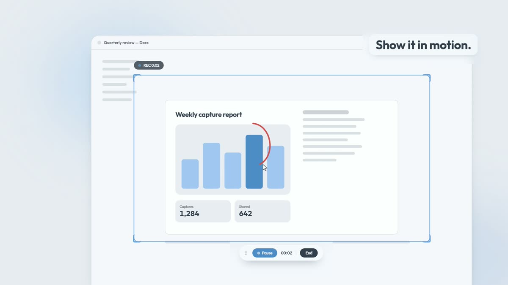
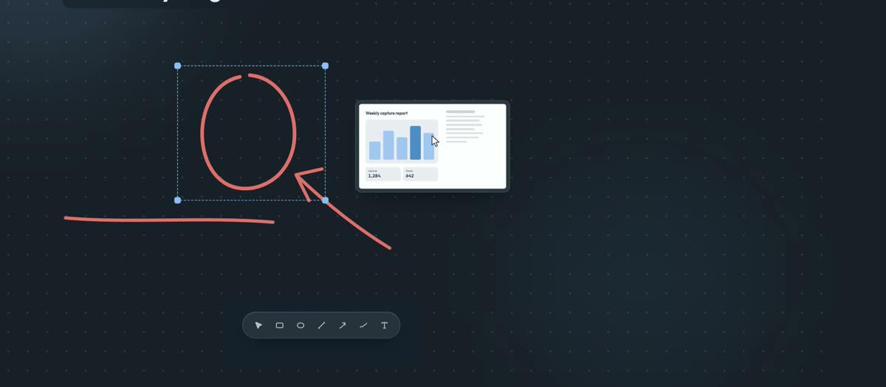

  

<h1 align="center">ClipMark</h1>

<b>Screenshots that explain themselves.</b> 
Capture any part of your screen, mark it up in seconds, and paste it wherever the conversation is.

<a href="https://pow3rcycle.github.io/clipmark-releases/"><b>Visit the website</b></a>

## Download

| Platform | Get it | Requirements |
|---|---|---|
| **Windows** | [Latest Windows installer](https://github.com/pow3rcycle/clipmark-releases/releases/latest) (`ClipMark-Setup-<version>.exe`) | Windows 10 (version 2004 or later) or Windows 11, 64-bit |
| **macOS** | [ClipMark for Mac 1.0.0](https://github.com/pow3rcycle/clipmark-releases/releases/tag/mac-v1.0.0) (`ClipMark-1.0.0.dmg`) | macOS 14 Sonoma or later, Apple silicon or Intel |

This repository holds installers and the update feed only. The source code is private.

## ClipMark in action

https://github.com/user-attachments/assets/626f37af-51b1-40fe-aa40-c45df039bd13

[Full-quality version (1080p)](https://github.com/pow3rcycle/clipmark-releases/raw/main/media/clipmark-product-video.mp4)

## What it does

| | |
|---|---|
|  | **Capture exactly what you mean.** Region, window or full screen, repeat the last area, or capture on a delay. **Scrolling capture** scrolls long pages for you and stitches one tall image. A preview card offers Edit, Copy, OCR, Pin and Save the moment you clip. |
|  | **Say it right on the pixels.** Straight, elbow and curved arrows; shapes in a clean or hand-drawn style; text labels and speech bubbles; numbered counters; a highlighter that snaps to text; blur, pixelate or hide for anything private; spotlight, magnifier and crop. The canvas grows when you draw past the edge. |
|  | **Show it in motion** *(Windows only for now).* Record a region to MP4 or GIF, with webcam and audio, and paste the recording straight into chat. |
|  | **A whiteboard for everything around it.** An infinite canvas with sticky notes, connectors that stay attached to their anchors, page margins, snapshots, and export to PNG, JPEG or PDF. |

**Everyday tools:** copy text from anything on screen (OCR), pin a capture above your windows, capture history, a screen color picker and ruler, light and dark themes, and global shortcuts for every capture mode (`Alt+Shift+1` for an area on Windows, `Option+Shift+1` on the Mac).

## Installing

### Windows

1. Download `ClipMark-Setup-<version>.exe` from the [latest release](https://github.com/pow3rcycle/clipmark-releases/releases/latest).
2. Run it. The installer is not code-signed yet, so Windows SmartScreen may show a warning the first time: choose **More info**, then **Run anyway**.

### macOS

1. Download `ClipMark-1.0.0.dmg` from the [Mac release](https://github.com/pow3rcycle/clipmark-releases/releases/tag/mac-v1.0.0). The app is signed and notarized by Apple.
2. Open the DMG and drag **ClipMark** into **Applications**.
3. On the first capture, allow **Screen Recording** in System Settings > Privacy & Security.
4. Scrolling capture's auto-scroll also asks for **Accessibility**. Manual scrolling works without it.

## Updates

- **Windows:** the app checks this repository's latest release and offers the new installer when one is out.
- **macOS:** the app checks for new Mac builds (tags starting `mac-v`), tells you when one is out and opens its download page; drag the new version to Applications.

Every release's notes are on the [releases page](https://github.com/pow3rcycle/clipmark-releases/releases) and on the [website](https://pow3rcycle.github.io/clipmark-releases/#releases).

## FAQ

**Is screen recording on the Mac?** Not yet. Everything else in the list above is in both apps.

**Why does the Mac release not show as "Latest"?** The Windows app's updater reads the latest release, so that label stays on the newest Windows build. Mac builds are listed alongside it.
